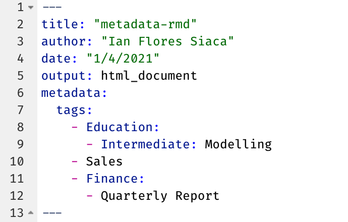

<!-- README.md is generated from README.Rmd. Please edit that file -->

# metadata

<!-- badges: start -->

[](https://www.tidyverse.org/lifecycle/#experimental)
[](https://CRAN.R-project.org/package=metadata)
<!-- badges: end -->

The goal of metadata is to …

## Installation

You can install the released version of metadata from
[CRAN](https://CRAN.R-project.org) with:

``` r
remotes::install_github("metadata")
```

## Example

### Load the library

``` r
library(metadata)
```

### Set up the credentials

``` r
Sys.setenv("CONNECT_SERVER" = "XXXXX")
Sys.setenv("CONNECT_API_KEY" = "XXXXX")
```

### Add tags to your document

You add tags to your document under the `metadata.tags` key.



### Publish RMarkdown documents

``` r
meta_publish_rmd(<rmd_file_path>, 
                 name = "rmd_deployment",
                 description = "This is a test deployment of the metadata pkg",
                 title = "RMarkdown Deployment")
```
